<p align="center">
  <a href="https://github.com/Emekalim/FroYoflix_v2">
    
  </a>
</p>

<h3 align="center">Manage your personal media library, organize your collection,<br>and stream your content in real time — no waiting required.</h3>

<p align="center">
  <a href="https://github.com/Emekalim/FroYoflix_v2/wiki/">📚 Wiki</a> •
  <a href="https://github.com/Emekalim/FroYoflix_v2/wiki/features/">✨ Features</a> •
  <a href="https://github.com/Emekalim/FroYoflix_v2/wiki/faq/">❓ FAQ</a> •
  <a href="#-installation">⬇️ Install</a> •
  <a href="#%EF%B8%8F-development-setup">🔧 Dev Setup</a> •
  <a href="https://github.com/Emekalim/FroYoflix_v2/releases/latest/">🚀 Latest Release</a> •
  <a href="#-contributing">🤝 Contribute</a>
</p>

<p align="center">
  <a href="https://github.com/Emekalim/FroYoflix_v2/releases/latest/"></a>
  <a href="https://github.com/Emekalim/FroYoflix_v2/releases/latest/"></a>
  <a href="https://github.com/Emekalim/FroYoflix_v2/commits"></a>
  <a href="https://github.com/Emekalim/FroYoflix_v2/stargazers"></a>
  <a href="./LICENSE"></a>
</p>

> [!IMPORTANT]
> FroYo **does not host, distribute, or provide media content**. It is a personal media library manager for content you **legally own**. Please respect all applicable copyright laws.

---

https://github.com/user-attachments/assets/3ff100f0-e008-4ff5-88f5-ad4290863f96

---

## ✨ Features

### Feature Overview

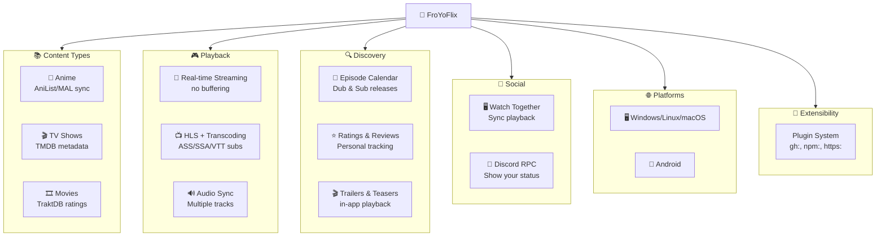

### Detailed Features

| Category | Highlights |
|----------|-----------|
| 🎌 **Anime** | AniList & MyAnimeList sync, episode auto-detection, dub/sub notifications, trailers, ratings |
| 🎬 **Multi-Media** | TV shows, movies, and anime — unified search and library |
| 🌊 **Streaming** | Real-time playback from your own files — no buffering wait |
| 🔌 **Extensions** | Plugin system for custom sources (`gh:`, `npm:`, HTTP, local) |
| 📺 **Video Player** | HLS + smart transcoding fallback, ASS/SSA/VTT subtitles, PiP, Discord RPC |
| 📅 **Schedule** | Upcoming episode calendar for dub & sub releases |
| 👥 **Watch Together** | Synchronized playback with others |
| 🖥️ **Desktop** | Windows, Linux, macOS (Electron) |
| 📱 **Mobile** | Android (Capacitor) |

<details>
<summary><b>Keyboard Shortcuts</b></summary>

| Key | Action |
|-----|--------|
| `S` | Skip opening (seek +90s) |
| `R` | Seek back 90s |
| `→` / `←` | Seek ±2s |
| `↑` / `↓` | Volume up/down |
| `M` | Mute |
| `C` | Cycle subtitle tracks |
| `F` | Toggle fullscreen |
| `P` | Toggle Picture-in-Picture |
| `N` / `B` | Next / previous episode |
| `O` | View anime details |
| `[` / `]` | Increase / decrease playback speed |
| `\` | Reset playback speed |
| `I` | Video stats overlay |
| `` ` `` | Open keybinds editor (drag & drop to remap) |

</details>

### User Journeys

```mermaid
graph TB
    subgraph ENDUSER ["🎬 End User"]
        EU["Install app<br/>(Windows/Linux/macOS/Android)"]
        EU --> EU1["Add media files<br/>to library"]
        EU1 --> EU2["Search & browse<br/>content"]
        EU2 --> EU3["Click Play"]
        EU3 --> EU4["Stream or sync<br/>with friends"]
        EU4 --> EU5["Enjoy with<br/>Discord RPC"]
    end
    
    subgraph DEVELOPER ["👨‍💻 Developer"]
        DEV["Clone repo"]
        DEV --> DEV1["Run pnpm install<br/>in electron/ or capacitor/"]
        DEV1 --> DEV2{Platform?}
        DEV2 -->|Desktop| DEV3["pnpm start<br/>Hot reload"]
        DEV2 -->|Mobile| DEV4["pnpm dev:start<br/>Deploy to ADB device"]
        DEV3 --> DEV5["Modify components<br/>& modules"]
        DEV4 --> DEV5
        DEV5 --> DEV6["Test in dev<br/>environment"]
        DEV6 --> DEV7["Run linting &<br/>tests"]
    end
    
    subgraph CONTRIBUTOR ["🔧 Contributor"]
        CONTRIB["Fork & clone"]
        CONTRIB --> CONTRIB1["Create feature<br/>branch"]
        CONTRIB1 --> CONTRIB2["Read docs/<br/>CONTRIBUTING.md"]
        CONTRIB2 --> CONTRIB3["Make code changes"]
        CONTRIB3 --> CONTRIB4["Test & lint"]
        CONTRIB4 --> CONTRIB5["Push & open PR"]
        CONTRIB5 --> CONTRIB6["Respond to<br/>review feedback"]
        CONTRIB6 --> CONTRIB7["✅ Merged!"]
    end
    
    subgraph EXTENDER ["🔌 Extension Creator"]
        EXT["Build extension"]
        EXT --> EXT1["Target: gh:, npm:,<br/>https:, or local"]
        EXT1 --> EXT2["Manifest + resolver<br/>functions"]
        EXT2 --> EXT3["Users discover &<br/>enable extension"]
        EXT3 --> EXT4["Runs in Web Worker<br/>via Comlink RPC"]
    end
```


<p align="center">
  
  
</p>
<p align="center">
  
  
</p>
<p align="center">
  
  
</p>

---

## 🏗️ Architecture

FroYo is a **pnpm monorepo** with five packages. `electron/` and `capacitor/` are thin platform shells — all UI and business logic lives in `common/`.

### Package Dependency Graph

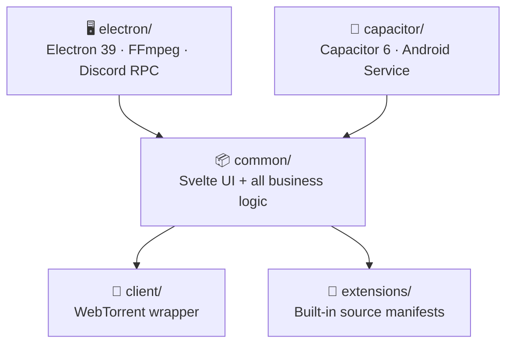

### Application Layers

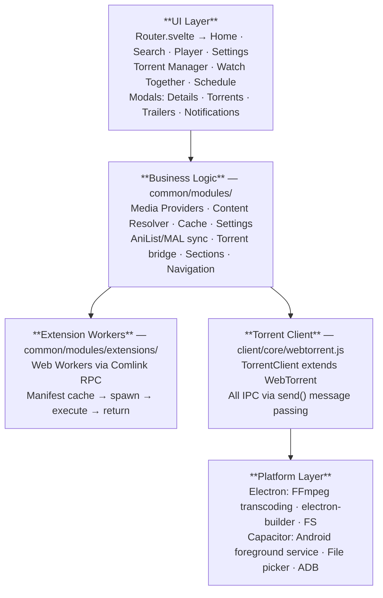

### Content Resolution Flow

When a user presses play, data flows across four major subsystems:

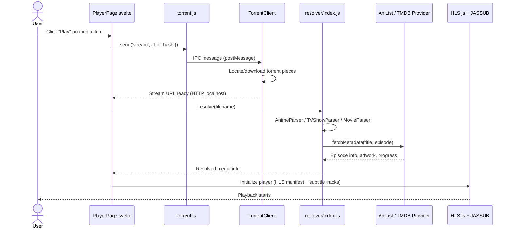

### Playback State Machine

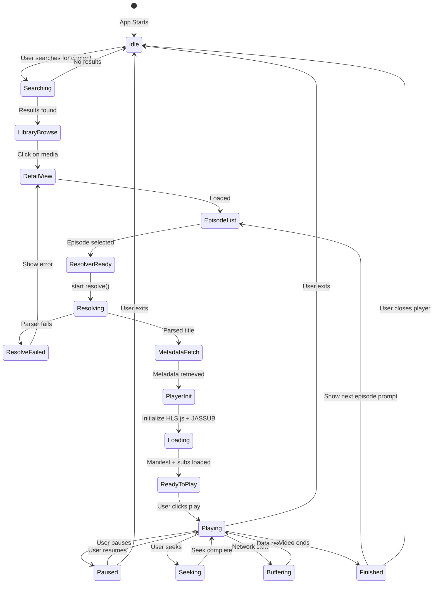

### Extension System Lifecycle

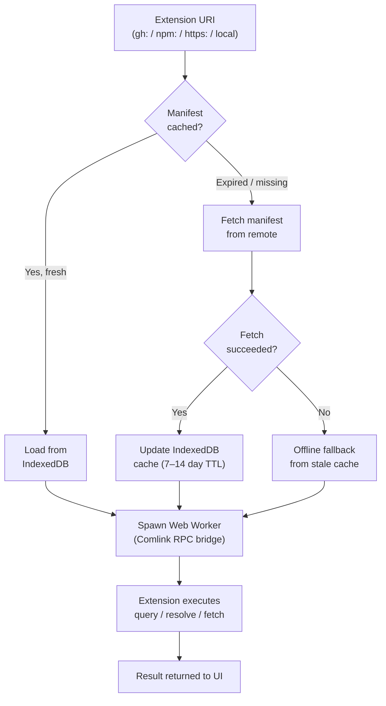

---

## ⬇️ Installation

### Installation Paths

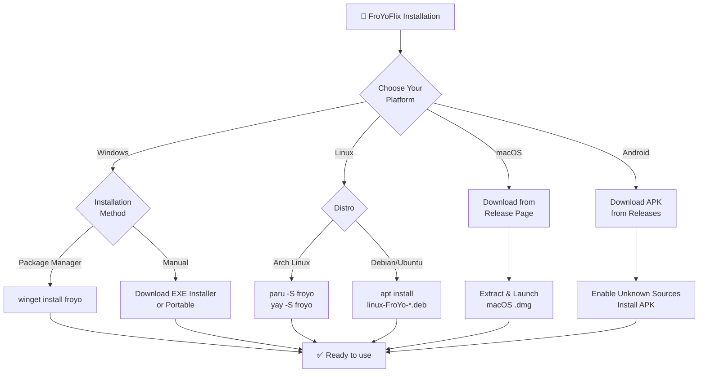

### 🖥️ Desktop

**Windows**

```bash
# Via winget (Windows 10 1809+ or Windows 11)
winget install froyo
```

Or download from the [releases page](https://github.com/Emekalim/FroYoflix_v2/releases/latest/):
- `win-FroYo-vx.x.x-installer.exe` — standard installer
- `win-FroYo-vx.x.x-portable.exe` — no install required

**Linux — Arch**

```bash
paru -S froyo
# or
yay -S froyo
```

**Linux — Debian / Ubuntu**

```bash
# Download linux-FroYo-version.deb from releases, then:
apt install ./linux-FroYo-*.deb
```

**macOS**

Download from the [releases page](https://github.com/Emekalim/FroYoflix_v2/releases/latest/) and extract the `.dmg` file.

### 📱 Android

Download the latest APK from the [releases page](https://github.com/Emekalim/FroYoflix_v2/releases/latest/) and install it on your device. Enable "Install from unknown sources" in Android settings if prompted.

---

## 🛠️ Development Setup

### Prerequisites Overview

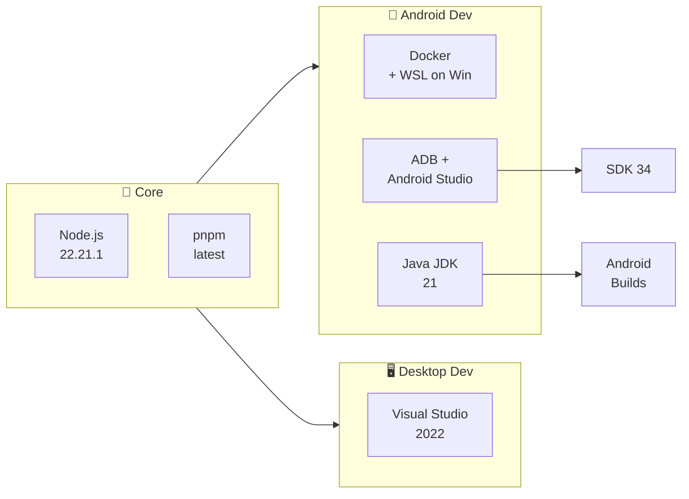

### Prerequisites

| Tool | Version | Required for |
|------|---------|-------------|
| Node.js | 22.21.1 | All |
| pnpm | latest | All |
| Docker (+ WSL on Windows) | any | Android native modules |
| ADB + Android Studio | SDK 34 | Android development |
| Java JDK | 21 | Android builds |
| Visual Studio | 2022 | Windows native modules |

---

### 🖥️ Desktop (Electron)

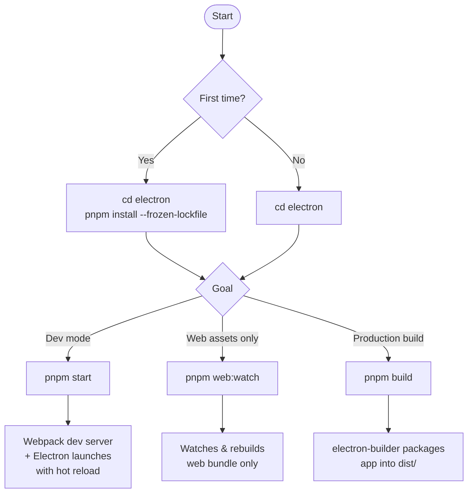

**Step by step:**

```bash
cd electron
pnpm install --frozen-lockfile

# Development (hot reload)
pnpm start

# Watch web assets only (run alongside pnpm electron:start)
pnpm web:watch

# Production release build
pnpm build
```

---

### 📱 Android (Capacitor)

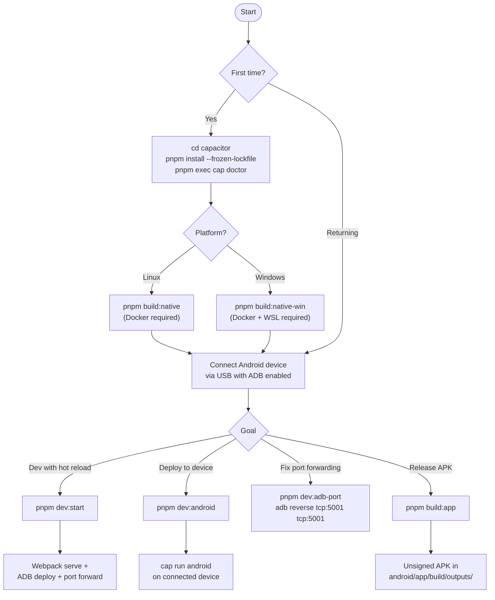

**Step by step:**

```bash
cd capacitor
pnpm install --frozen-lockfile

# Verify all dependencies are present
pnpm exec cap doctor

# First time only — build native Node modules
pnpm build:native        # Linux
pnpm build:native-win    # Windows

# (Optional) Regenerate app icons & splash screens
pnpm build:assets

# Open project in Android Studio
pnpm exec cap open android

# Development — requires a connected ADB device
pnpm dev:start           # webpack serve + deploy + port forward

# If port forwarding drops during dev
pnpm dev:adb-port

# Production APK (unsigned — see NoCrypt/sign-android for signing)
pnpm build:app
```

> [!NOTE]
> `pnpm dev:start` simultaneously runs the webpack dev server and deploys to your device. The device must be connected and visible to ADB before running this command.

---

### 🧪 Running Tests

Tests use vanilla Node.js — no test framework required:

```bash
# From the repo root
node common/modules/__tests__/mediaType.test.mjs
node common/modules/extensions/__tests__/run-all.mjs
node common/modules/providers/__tests__/run-all.mjs
node common/modules/resolver/__tests__/run-all.mjs
```

Android unit tests live in `capacitor/android/app/src/test/` and run via Android Studio or Gradle.

### 🔍 Linting

```bash
# From electron/ or capacitor/
pnpm exec eslint src/
```

---

## 📁 Project Structure

### Directory Organization

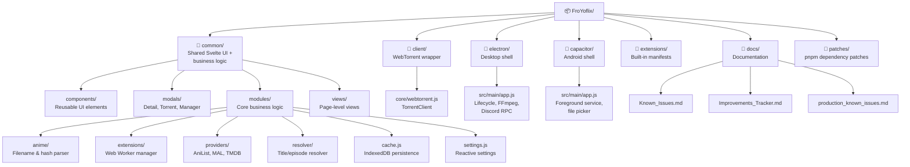

### Full Structure

```
FroYoflix/
├── common/                    # Shared Svelte UI + all business logic
│   ├── components/            # Reusable UI components (CustomDropdown, etc.)
│   ├── modals/                # Detail, Torrent, Manager, Trailer modals
│   ├── modules/               # Core logic modules
│   │   ├── anime/             # Anime filename resolver, hash, parser
│   │   ├── extensions/        # Extension manager (Web Worker + Comlink)
│   │   ├── providers/         # AniList, MAL, TMDB, Trakt adapters
│   │   ├── resolver/          # Title/episode resolver (TV, anime, movie)
│   │   ├── cache.js           # IndexedDB persistence layer (66 dependents)
│   │   ├── settings.js        # Reactive settings store (47 dependents)
│   │   ├── anilist.js         # AniList GraphQL client (45 dependents)
│   │   ├── torrent.js         # IPC bridge to client/
│   │   └── util.js            # General utilities (55 dependents)
│   └── views/                 # Page-level views (Home, Search, Player, etc.)
│
├── client/                    # WebTorrent client wrapper
│   └── core/webtorrent.js     # TorrentClient — all IPC via send()
│
├── electron/                  # Desktop app shell
│   └── src/main/app.js        # Entry point: lifecycle, FFmpeg, Discord RPC
│
├── capacitor/                 # Android app shell
│   └── src/main/app.js        # Entry point: foreground service, file picker
│
├── extensions/                # Built-in extension source manifests (JSON)
│
├── docs/                      # Project documentation
│   ├── Known_Issues.md
│   ├── Improvements_Tracker.md
│   └── production_known_issues.md
│
└── patches/                   # pnpm dependency patches
```

### High-Blast-Radius Modules

> Changing these affects 45–67 other files. Use `roam preflight <name>` before editing.

| Module | Dependents | Role |
|--------|-----------|------|
| `common/modules/cache.js` | 66 | IndexedDB persistence |
| `common/modules/util.js` | 55 | General utilities |
| `common/modules/settings.js` | 47 | Reactive settings store |
| `common/modules/anilist.js` | 45 | AniList GraphQL client |
| `common/components/CustomDropdown.svelte` | 61 | Core UI dropdown |

---

## 🤝 Contributing

### Contribution Workflow

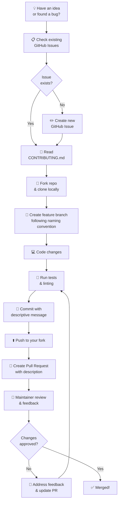

### Getting Started

See [CONTRIBUTING.md](.github/CONTRIBUTING.md) for the full guide including:
- **Branch naming conventions** — `feature/`, `fix/`, `docs/`, `chore/`
- **PR process** — description requirements, review checklist
- **Code style** — ESLint, formatting, naming conventions
- **Testing requirements** — unit tests, integration tests
- **Commit message standards** — clear, descriptive messages

**Quick Links:**
- 📋 [GitHub Issues](https://github.com/Emekalim/FroYoflix_v2/issues) — Report bugs or request features
- 🔀 [Pull Requests](https://github.com/Emekalim/FroYoflix_v2/pulls) — Submit your changes
- 📚 [Project Wiki](https://github.com/Emekalim/FroYoflix_v2/wiki/) — In-depth documentation

---

## 📜 License

[GPLv3](./LICENSE) — © Emekalim
