c<p align="center">
  <a href="https://github.com/Emekalim/FroYoflix_v2">
    
  </a>
</p>

<h3 align="center">Manage your personal media library, organize your collection,<br>and stream your content in real time — no waiting required.</h3>

<p align="center">
  <a href="https://github.com/Emekalim/FroYoflix_v2/wiki/">Wiki</a> •
  <a href="https://github.com/Emekalim/FroYoflix_v2/wiki/features/">Features</a> •
  <a href="https://github.com/Emekalim/FroYoflix_v2/wiki/faq/">FAQ</a> •
  <a href="#installation">Install</a> •
  <a href="#development-setup">Dev Setup</a> •
  <a href="https://github.com/Emekalim/FroYoflix_v2/releases/latest/">Latest Release</a> •
  <a href="#contributing">Contribute</a>
</p>

<p align="center">
  
  <a href="./LICENSE"></a>
  <a href="https://github.com/Emekalim/FroYoflix_v2/releases/latest/"></a>
  <a href="https://github.com/Emekalim/FroYoflix_v2/releases/latest/"></a>
  <a href="https://github.com/Emekalim/FroYoflix_v2/commits"></a>
  <a href="https://github.com/Emekalim/FroYoflix_v2/stargazers"></a>
</p>

> [!IMPORTANT]
> FroYo is intended for **personal use only**. It does not host, distribute, or provide media content. It is a personal media library manager for content you **legally own**. Please respect all applicable copyright laws.

---

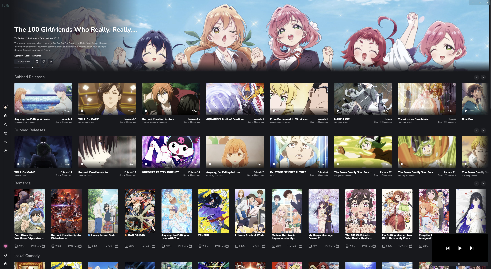

---

## Feature Overview

- 📺 **Stream torrents** while downloading via WebTorrent + HLS
- 🎬 **Smart transcoding** with FFmpeg and HandBrake repair fallback for corrupted files
- 🔍 **Multi-provider search** across AniList, TMDB, MAL, and Trakt
- 📅 **Schedule & tracking** — AniList + MAL sync, episode progress, airing calendar
- 🧩 **Extension system** — install torrent source plugins from GitHub or npm at runtime
- 🤝 **Watch Together** — synchronized playback across devices
- 🖥️ **Cross-platform** — Windows, Linux (Electron) + Android (Capacitor)
- ⚡ **Performance** — IndexedDB caching, banner rotation, reactive UI

<details>
<summary><b>Keyboard Shortcuts</b></summary>

| Key | Action |
|-----|--------|
| `S` | Skip opening (seek +90s) |
| `R` | Seek back 90s |
| `→` / `←` | Seek ±2s |
| `↑` / `↓` | Volume up/down |
| `M` | Mute |
| `C` | Cycle subtitle tracks |
| `F` | Toggle fullscreen |
| `P` | Toggle Picture-in-Picture |
| `N` / `B` | Next / previous episode |
| `O` | View anime details |
| `[` / `]` | Increase / decrease playback speed |
| `\` | Reset playback speed |
| `I` | Video stats overlay |
| `` ` `` | Open keybinds editor (drag and drop to remap) |

</details>

### Screenshots

<p align="center">
  
  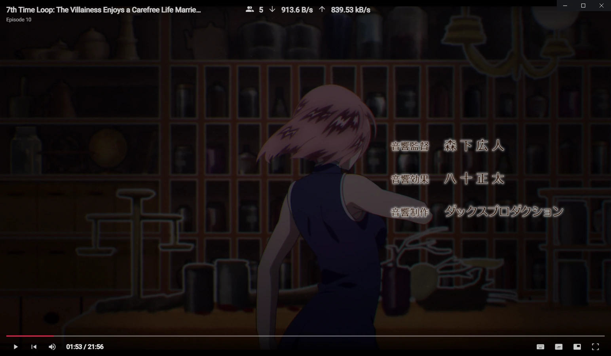
</p>
<p align="center">
  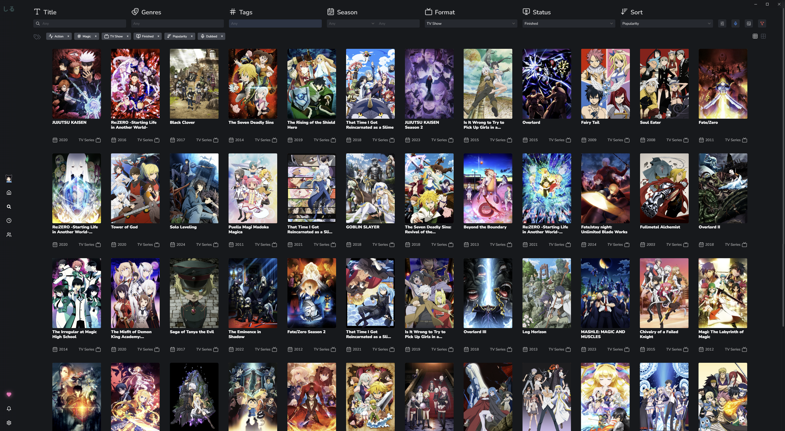
  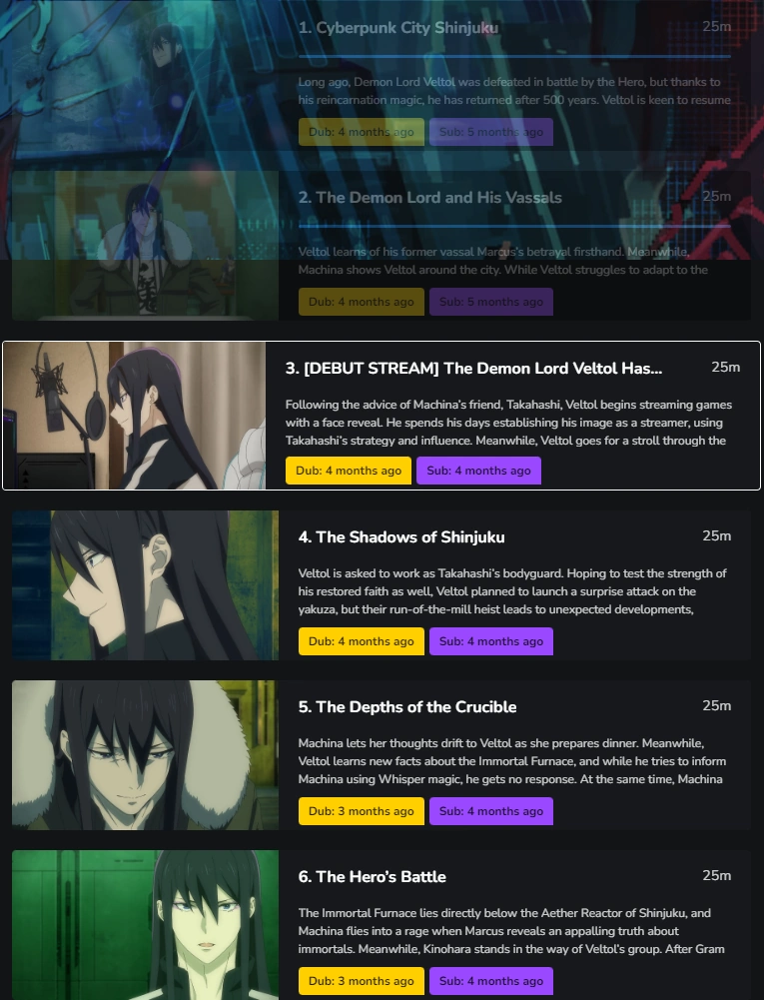
</p>
<p align="center">
  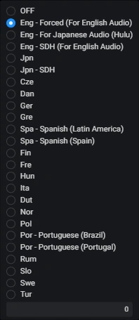
  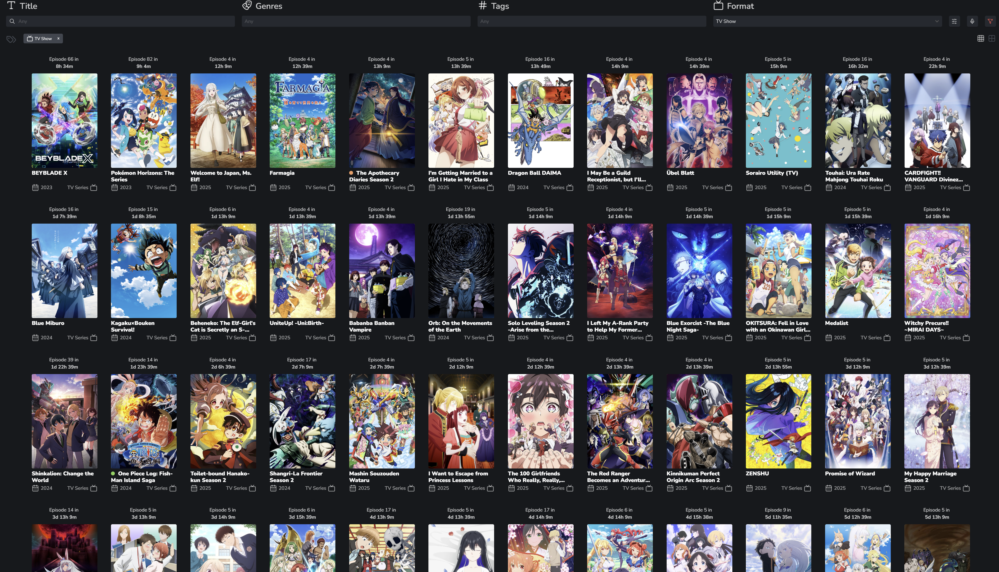
</p>
<p align="center">
  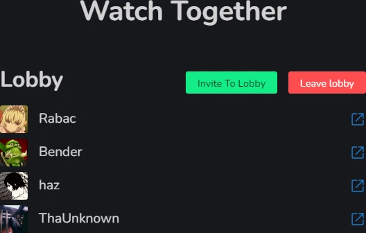
</p>

---

## Architecture

FroYo is a **pnpm monorepo** with five packages. `electron/` and `capacitor/` are thin platform shells — all UI and business logic lives in `common/`.

### Package Dependency Graph

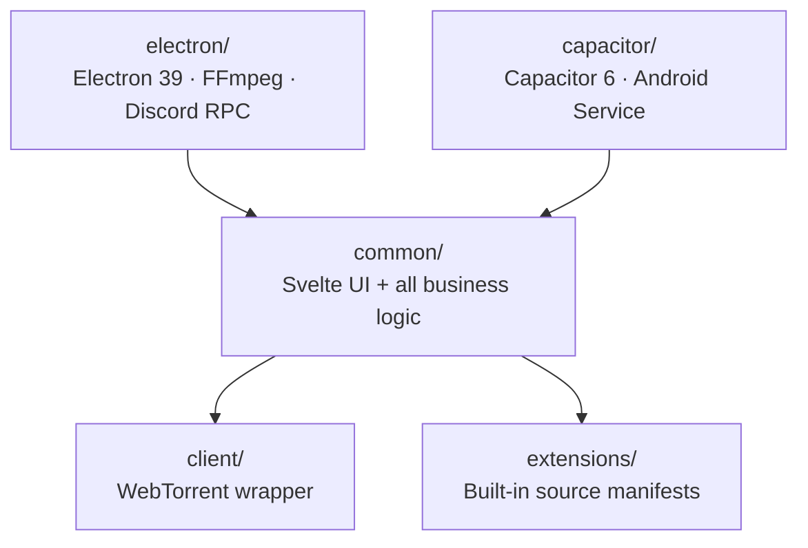

### Application Layers

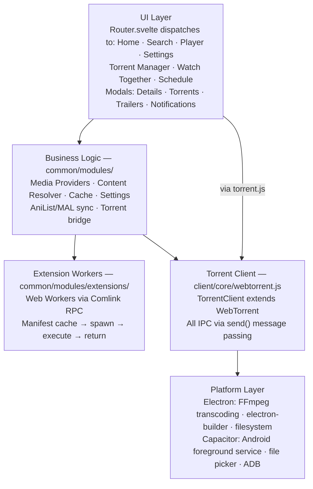

### Content Resolution Sequence

When a user presses play, data flows across four major subsystems:

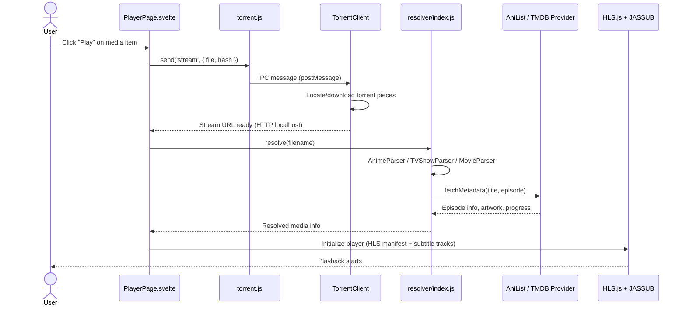

### Extension System Lifecycle

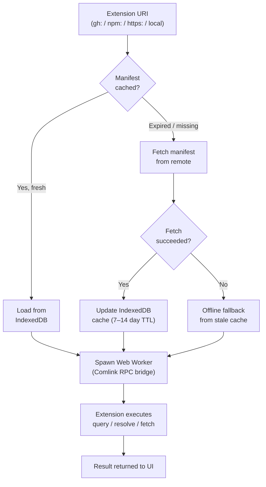

---

## Installation

### Windows

**Via winget (Windows 10 1809+ or Windows 11)**

```bash
winget install froyo
```

Or download from the [releases page](https://github.com/Emekalim/FroYoflix_v2/releases/latest/):
- `win-FroYo-vx.x.x-installer.exe` — standard installer
- `win-FroYo-vx.x.x-portable.exe` — no install required

### Linux

**Arch Linux**

```bash
paru -S froyo
# or
yay -S froyo
```

**Debian / Ubuntu**

```bash
# Download linux-FroYo-version.deb from the releases page, then:
apt install ./linux-FroYo-*.deb
```

### Android

Download the latest APK from the [releases page](https://github.com/Emekalim/FroYoflix_v2/releases/latest/). Enable "Install from unknown sources" in Android settings if prompted, then install the APK.

---

## Development Setup

### Prerequisites

| Tool | Version | Required for |
|------|---------|-------------|
| Node.js | 22.21.1 | All |
| pnpm | latest | All |
| Docker (+ WSL on Windows) | any | Android native modules |
| ADB + Android Studio | SDK 34 | Android development |
| Java JDK | 21 | Android builds |
| Visual Studio | 2022 | Windows native modules |

### Desktop (Electron)

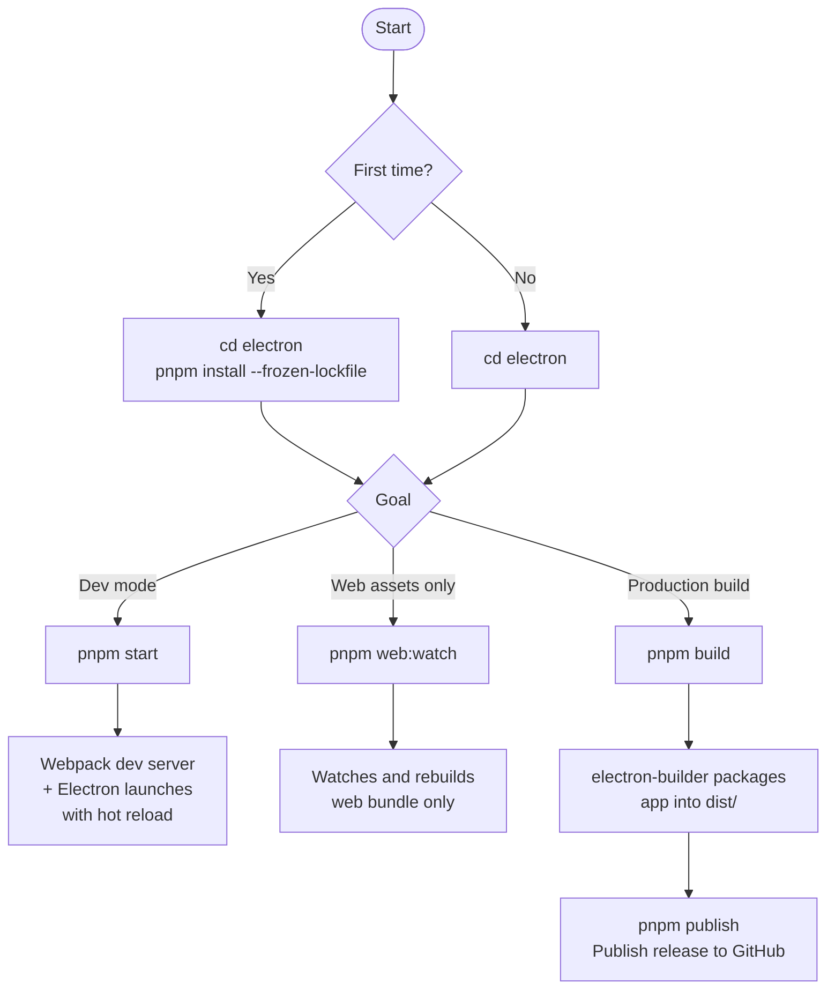

```bash
cd electron
pnpm install --frozen-lockfile

# Development with hot reload
pnpm start

# Watch web assets only (run alongside pnpm electron:start)
pnpm web:watch

# Production web build only
pnpm web:build

# Run Electron without rebuilding web (pair with pnpm web:watch)
pnpm electron:start

# electron-builder only (skips web rebuild)
pnpm electron:build

# Production release build
pnpm build

# Publish release to GitHub
pnpm publish
```

### Android (Capacitor)

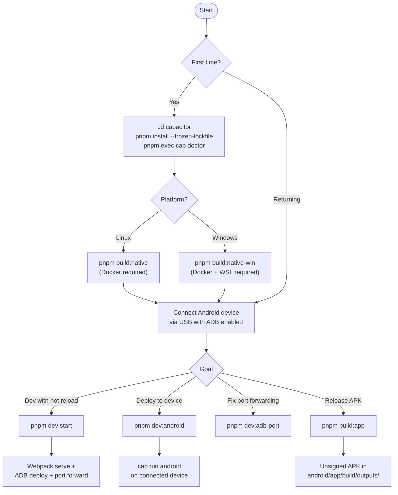

```bash
cd capacitor
pnpm install --frozen-lockfile

# Verify all dependencies are present
pnpm exec cap doctor

# First time only — build native Node modules
pnpm build:native        # Linux
pnpm build:native-win    # Windows

# Open project in Android Studio
pnpm exec cap open android

# Development — requires a connected ADB device
pnpm dev:start           # webpack serve + deploy + port forward

# If port forwarding drops during development
pnpm dev:adb-port

# Production APK (unsigned)
pnpm build:app
```

> [!NOTE]
> `pnpm dev:start` simultaneously runs the webpack dev server and deploys to your device. The device must be connected and visible to ADB before running this command.

### Running Tests

Tests use vanilla Node.js — no test framework required:

```bash
# From the repo root
node common/modules/__tests__/mediaType.test.mjs
node common/modules/extensions/__tests__/run-all.mjs
node common/modules/providers/__tests__/run-all.mjs
node common/modules/resolver/__tests__/run-all.mjs
```

Android unit tests live in `capacitor/android/app/src/test/` and run via Android Studio or Gradle.

### Linting

```bash
# From electron/ or capacitor/
pnpm exec eslint src/
```

---

## Project Structure

```
FroYoflix/
├── common/                    # Shared Svelte UI + all business logic
│   ├── components/            # Reusable UI components (CustomDropdown, etc.)
│   ├── modals/                # Detail, Torrent, Manager, Trailer modals
│   ├── modules/               # Core logic modules
│   │   ├── anime/             # Anime filename resolver, hash, parser
│   │   ├── extensions/        # Extension manager (Web Worker + Comlink)
│   │   ├── providers/         # AniList, MAL, TMDB, Trakt adapters
│   │   ├── resolver/          # Title/episode resolver (TV, anime, movie)
│   │   ├── cache.js           # IndexedDB persistence layer (66 dependents)
│   │   ├── settings.js        # Reactive settings store (47 dependents)
│   │   ├── anilist.js         # AniList GraphQL client (45 dependents)
│   │   ├── torrent.js         # IPC bridge to client/
│   │   └── util.js            # General utilities (55 dependents)
│   └── routes/                # Page-level views (Home, Search, Player, etc.)
│
├── client/                    # WebTorrent client wrapper
│   └── core/webtorrent.js     # TorrentClient — all IPC via send()
│
├── electron/                  # Desktop app shell
│   └── src/main/app.js        # Entry point: lifecycle, FFmpeg, Discord RPC
│
├── capacitor/                 # Android app shell
│   └── src/main/app.js        # Entry point: foreground service, file picker
│
├── extensions/                # Built-in extension source manifests (JSON)
│
├── docs/                      # Project documentation
│   ├── Known_Issues.md
│   ├── Improvements_Tracker.md
│   └── production_known_issues.md
│
└── patches/                   # pnpm dependency patches
```

### High-Blast-Radius Modules

Changing these affects 45–67 other files. Use `roam preflight <name>` before editing.

| Module | Dependents | Role |
|--------|-----------|------|
| `common/modules/cache.js` | 66 | IndexedDB persistence |
| `common/modules/util.js` | 55 | General utilities |
| `common/modules/settings.js` | 47 | Reactive settings store |
| `common/modules/anilist.js` | 45 | AniList GraphQL client |
| `common/modules/providers/tmdb/mapper.js` | — | TMDB data mapping |
| `common/components/CustomDropdown.svelte` | 61 | Core UI dropdown |

---

## Contributing

Contributions are welcome. Please open an issue before starting significant work.

See [CONTRIBUTING.md](.github/CONTRIBUTING.md) for the full guide including:
- Branch naming conventions — `feature/`, `fix/`, `docs/`, `chore/`
- PR process — description requirements, review checklist
- Code style — ESLint, formatting, naming conventions
- Testing requirements — unit tests, integration tests
- Commit message standards — type prefix (`feat:`, `fix:`, `chore:`, `refactor:`, `docs:`), first line under 40 characters

**Links:**
- [GitHub Issues](https://github.com/Emekalim/FroYoflix_v2/issues) — report bugs or request features
- [Pull Requests](https://github.com/Emekalim/FroYoflix_v2/pulls) — submit changes
- [Project Wiki](https://github.com/Emekalim/FroYoflix_v2/wiki/) — in-depth documentation

---

## License

[GPLv3](./LICENSE) — Copyright Emekalim
