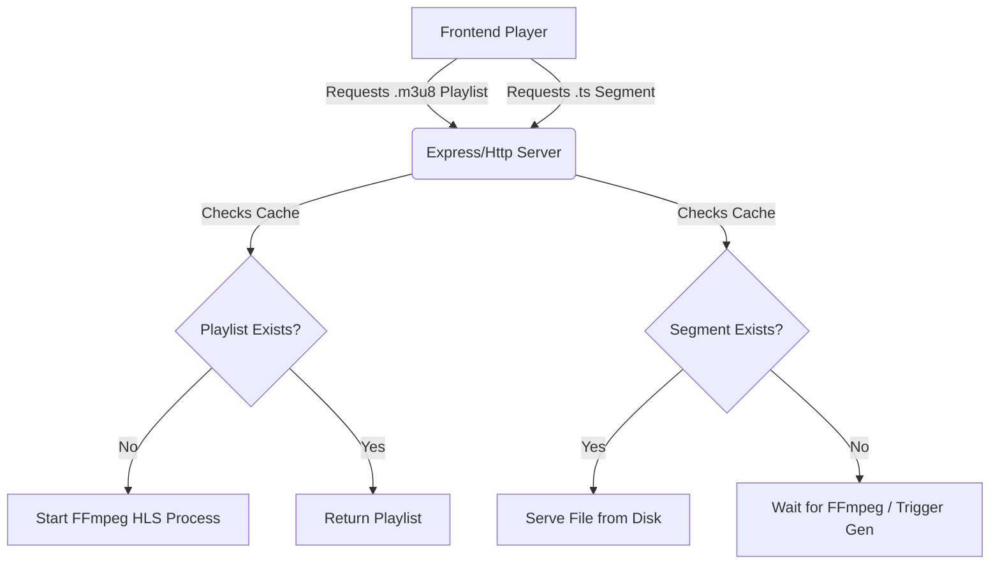

# HLS & Caching Architecture for Local Transcoding

## Problem Statement
The initial implementation of local transcoding uses a direct stream pipe. While functional, this approach has limitations:
1.  **Inefficient Seeking:** Jumping to a specific timestamp requires restarting the FFmpeg process and seeking from the input file, which introduces latency.
2.  **No Persistence:** If the user closes the player or application, all transcoded data is lost. Replaying the same video requires re-transcoding.
3.  **Buffering Constraints:** The browser's HTML5 video element manages buffering opaque to the application, making it difficult to control pre-loading behavior.

## Proposed Solution
Migrating to **HTTP Live Streaming (HLS)** with a local file-based cache solves these issues by breaking the video into small, manageable segments.

### high-Level Architecture



### Technical Implementation

#### 1. Backend: FFmpeg HLS Configuration
The `transcoder.js` service will be updated to output HLS playlists and segments instead of a single MP4 stream.

**Key FFmpeg Flags:**
*   `-f hls`: Output format.
*   `-hls_time 6`: Target segment duration (6 seconds is a good balance for seek granularily vs overhead).
*   `-hls_list_size 0`: Keep all segments in the playlist (VOD mode, not Live).
*   `-hls_segment_filename`: Pattern for naming segments (e.g., `segment_%03d.ts`).

#### 2. Caching Strategy
We will use a dedicated temporary directory for caching transcoded output.

**Directory Structure:**
```
/tmp/froyoflix-transcode/
├── <hash_of_input_file_path>/
│   ├── playlist.m3u8
│   ├── segment_000.ts
│   ├── segment_001.ts
│   └── ...
└── ...
```

**Cache Key:**
A unique hash (SHA-256) generated from the source file path and its modification time ensures that if the file changes, the cache is invalidated.

#### 3. Frontend: HLS.js Integration
The `PlayerPage.svelte` will be updated to use `hls.js`, a JavaScript library that implements an HLS client.

*   **Adaptive Loading:** HLS.js handles fetching segments and buffering.
*   **Error Handling:** Robust retry logic for network/transcoding hiccups.
*   **Quality Switching:** (Optional Future) Support for multi-quality streams (e.g., 720p, 1080p).

#### 4. Pre-loading & Optimization
*   **Look-ahead Transcoding:** The FFmpeg process can run faster than real-time, generating segments ahead of the player's current position.
*   **Persistent Cache:** By not deleting the cache folder immediately on close, we allow users to resume playback instantly even after restarting the app (until the OS clears the temp folder or we implement an LRU cleanup).

## Roadmap

### Phase 1: Basic HLS (MVP)
- [ ] Update `transcoder.js` to specific HLS output.
- [ ] Implement temporary file storage management.
- [ ] Integrate `hls.js` into the frontend.

### Phase 2: Advanced Caching
- [ ] Implement content hashing for persistent cache keys.
- [ ] Add LRU (Least Recently Used) cleanup logic to manage disk space.
- [ ] Support fast-seeking by starting transcoding at the requested timestamp if the segment is missing.

### Phase 3: Performance Tuning
- [ ] Experiment with segment sizes (2s vs 6s vs 10s).
- [ ] Optimize FFmpeg presets for hardware acceleration (if available).
